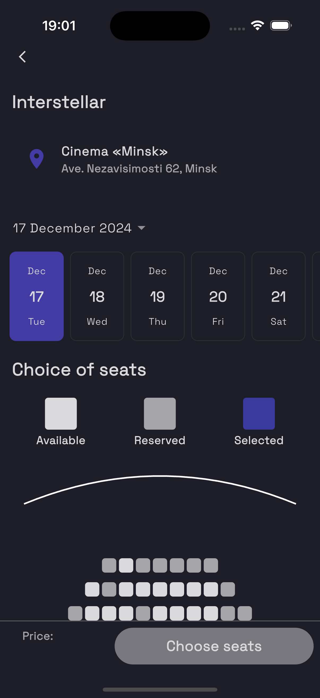
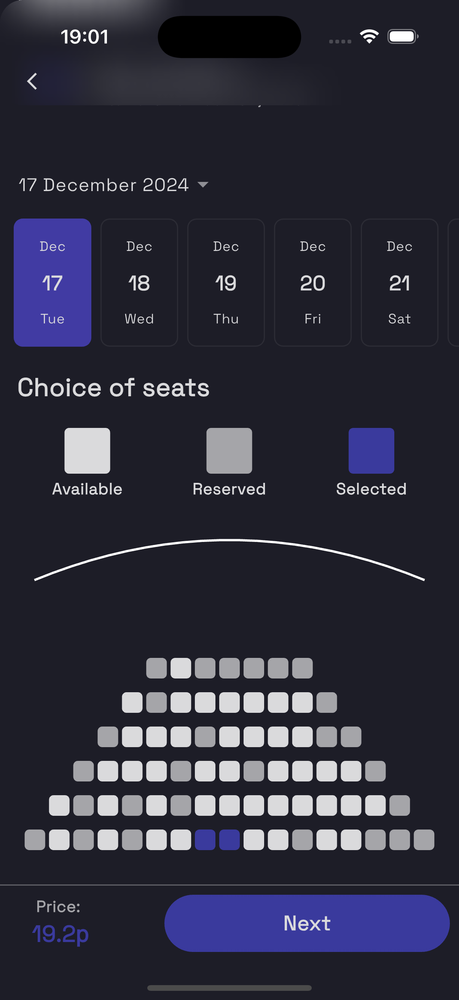

# 🎬 Cinema Mobile App

A modern mobile application for browsing movies and purchasing tickets, built with Flutter.

## 📱 Screenshots

| Main Screen | Movie Details |
|------------|---------------|
|  |  |

| Buy Ticket - Header | Buy Ticket - Bottom |
|--------------------|-------------------|
|  |  |

## ✨ Features

- Browse latest movies
- View detailed movie information
- Select seats and show times
- Purchase tickets
- Secure authentication
- User profile management

## 🛠 Technologies Used

- Flutter
- Bloc (State Management)
- GetIt (Dependency Injection)
- Dio (HTTP Client)
- Flutter Secure Storage
- Talker (Logging)

## 🚀 Getting Started

### Prerequisites

- Flutter SDK
- Dart SDK
- Android Studio / VS Code
- Backend API running

### Installation

1. Clone the repository
```bash
git clone https://github.com/nikameru/cinema-backend.git
```
### .env Example

```env
ENDPOINT=http://127.0.0.1:3000
```

